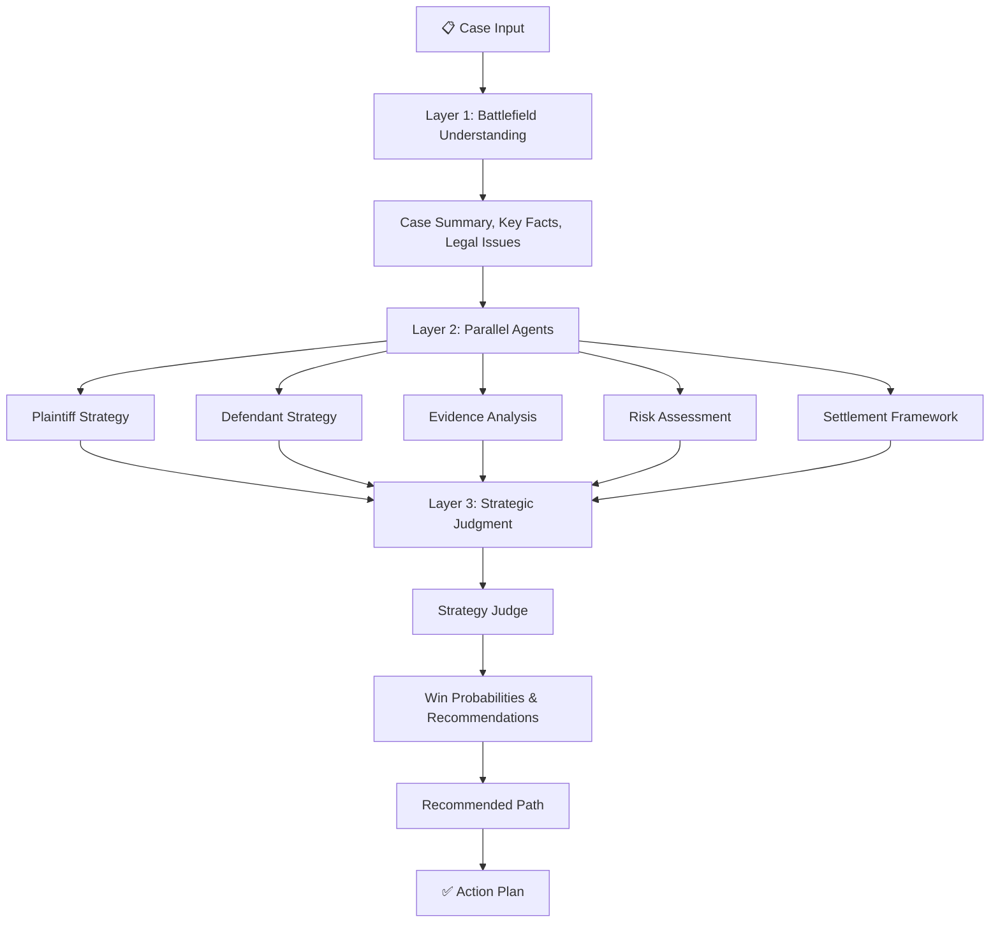
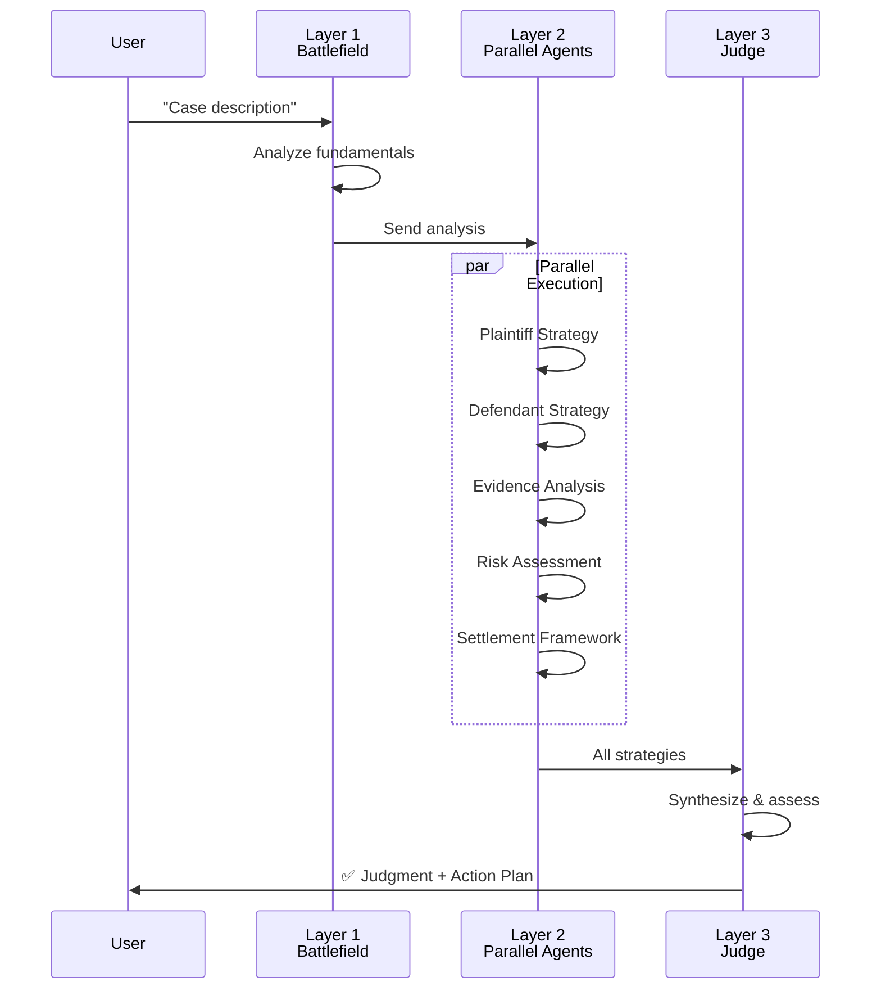
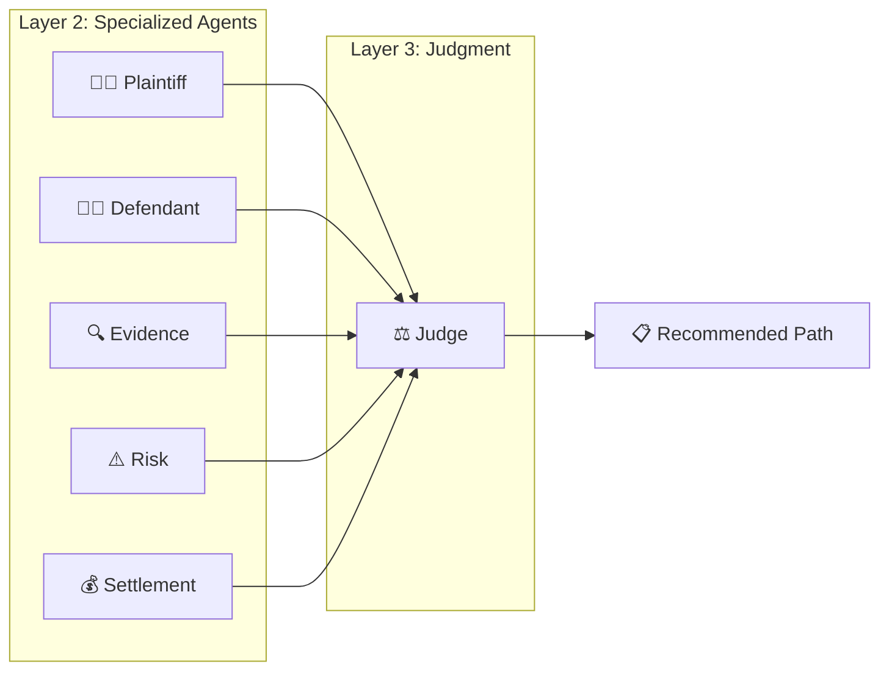

# ⚖️ Legal Strategy Swarm

AI-powered legal case analyzer using a 3-layer agent swarm. Synthesizes multiple legal perspectives and recommends strategic action plans.

## 🎯 What It Does

Takes a case description and generates:
- Battlefield analysis (case fundamentals)
- 5 parallel strategic perspectives (plaintiff, defendant, evidence, risk, settlement)
- Win probability assessments
- Concrete action recommendations

## 🏗️ Architecture



## 🚀 Quick Start

### Installation

```bash
# Clone/navigate to project
cd swarm_strategy

# Create virtual environment
python -m venv venv
source venv/bin/activate  # Windows: venv\Scripts\activate

# Install dependencies
pip install -r requirements.txt

# Set up .env
echo "GROQ_API_KEY=your_api_key_here" > .env
```

### Run Locally

**Web UI (Streamlit):**
```bash
streamlit run app.py
```
Opens at `http://localhost:8501`

**CLI (Python):**
```bash
python test_minimal.py
```

## 📊 Data Flow



## 📁 Project Structure

```
swarm_strategy/
├── app.py                          # Streamlit UI
├── graph.py                        # LangGraph orchestration
├── test_minimal.py                 # CLI test runner
├── requirements.txt                # Dependencies
│
├── core/
│   ├── llm.py                     # LLM interface (Groq)
│   ├── state.py                   # Global state schema
│   └── schemas.py                 # Core data models
│
├── layer_1_understanding/
│   ├── battlefield_understanding_agent.py
│   ├── schemas.py                 # BattlefieldAnalysis
│   └── prompts.py
│
├── layer_2_strategy/
│   ├── plaintiff_strategy_agent.py
│   ├── defendant_strategy_agent.py
│   ├── evidence_attack_agent.py
│   ├── risk_assessment_agent.py
│   ├── settlement_agent.py
│   ├── schemas.py                 # All Layer 2 schemas
│   └── prompts.py
│
├── layer_3_coordination/
│   ├── judge_agent.py             # Judge + Recommended Path
│   ├── schemas.py                 # StrategyJudgment, RecommendedPath
│   └── prompts.py
│
├── .streamlit/config.toml         # Streamlit theme
├── DEPLOYMENT.md                  # Hosting guide
└── ARCHITECTURE.md                # Detailed architecture
```

## 🎮 Usage Example

### Web UI
1. Open `http://localhost:8501`
2. Paste case description
3. Click "Analyze Case"
4. Review all 3 layers of analysis
5. Follow recommended action plan

### Python
```python
from graph import graph
from core.state import StrategyState

complaint = "Client paid 50% for services. Defendant didn't deliver."

result = graph.invoke({
    "complaint": complaint
})

# Access results
print(result["battlefield_analysis"])
print(result["strategy_judgment"])
print(result["recommended_path"])
```

## 🔑 Key Features

| Layer | Components | Output |
|-------|-----------|--------|
| **1** | Case Analysis | Summary, Facts, Legal Issues, Strength |
| **2** | 5 Parallel Agents | Arguments, Defenses, Evidence, Risks, Settlement Terms |
| **3** | Judge + Planner | Win %, Strategy, Action Plan with Metrics |

## 📈 Agent Details



## ⚙️ Configuration

### Environment Variables
```bash
GROQ_API_KEY=your_api_key_here
```

### Streamlit Config (`.streamlit/config.toml`)
- Theme: Dark (professional blue accent)
- Layout: Wide
- Toolbar: Minimal

## 🤖 Tech Stack

- **LangGraph**: Agent orchestration
- **Groq**: Fast LLM inference
- **Streamlit**: Web UI
- **Pydantic**: Data validation
- **LangChain**: LLM framework

## 📊 Output Metrics

The Judge outputs:
- **Strategy Recommendation**: plaintiff_lean | defendant_lean | settlement_focus
- **Confidence Level**: 0-100%
- **Plaintiff Win Chance**: 0-100%
- **Defendant Win Chance**: 0-100%
- **Settlement Probability**: 0-100%

## 🎯 Action Plan Output

- **Immediate**: What to do now
- **30 Days**: Short-term strategy
- **6 Months**: Long-term vision
- **Metrics**: Success tracking

## 🔒 Security

- Store `GROQ_API_KEY` in `.env` (never commit)
- Use Streamlit Secrets for production
- No data persistence—all analysis is ephemeral

## 📝 Example Output

```
BATTLEFIELD ANALYSIS
├─ Case Summary: Client breach dispute
├─ Key Facts: 50% paid, non-delivery
├─ Legal Issues: Breach, damages
└─ Strength: Moderate

STRATEGY JUDGE
├─ Recommended: plaintiff_lean
├─ Confidence: 80%
├─ Plaintiff Win: 80%
├─ Defendant Win: 20%
└─ Settlement: 45%

RECOMMENDED PATH
├─ Immediate: Send demand letter
├─ 30 Days: Negotiate settlement
├─ 6 Months: File lawsuit if needed
└─ Metrics: Recovery target 90%+
```

## 🐛 Troubleshooting

| Issue | Solution |
|-------|----------|
| Import Error | `pip install -r requirements.txt` |
| Rate Limit | Wait 5-10 seconds, retry |
| Missing .env | Create with `GROQ_API_KEY` |
| Streamlit not found | `pip install streamlit` |

## 📚 Documentation

- [DEPLOYMENT.md](DEPLOYMENT.md) - Hosting & production setup
- [ARCHITECTURE.md](ARCHITECTURE.md) - Detailed system design
- [test_minimal.py](test_minimal.py) - Code examples

## 📄 License

Internal use only.

---

**Legal Strategy Swarm v1.0** | Built with LangGraph + Groq

*Disclaimer: Educational tool. Not legal advice.*
